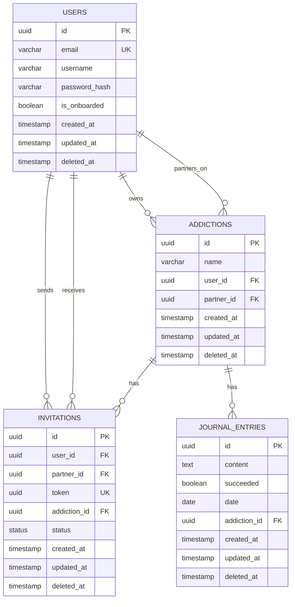

<p align="center">
  
</p>

<h2 align="center">
  Turns out your mom did raise a Quittr.
</h2>

Quittr is a full-stack learning project built to explore how accountability-based habit tracking apps are designed, developed, and deployed.

It is not intended as medical, clinical, or addiction recovery advice. The goal of this project is to practice building a production-style full-stack application with authentication, relational data modeling, partner workflows, journaling, and deployment.

---

## Why I Built It
This project came from a personal spot so I wanted to build something real from the idea that I already had.

I built Quittr to learn how to design and ship a real full-stack product from idea to deployment.

The project helped me practice:

- Building secure authentication flows
- Designing relational database schemas
- Managing partner/accountability workflows
- Creating user dashboards and tracking interfaces
- Deploying a frontend and backend with custom domains
- Handling real production issues like CORS, environment variables, and API rate limits

---

## Architectural Decisions & Tradeoffs

- Used middleware-based validation for tokens and request payloads, with Zod schemas to prevent incomplete or invalid data from reaching API handlers.
- Implemented HttpOnly cookies for authentication to reduce exposure of JWTs to client-side JavaScript.
- Used PostgreSQL with Drizzle ORM for SQL-first schema design, relational constraints, and type-safe database access.
- Modeled the core domain around users, addictions, invitations, and journal entries to support accountability partner workflows directly.
- Used database transactions for multi-step operations to maintain data integrity and avoid partial updates.
- Cached journal entries and user information on the frontend to reduce repeated backend requests and improve perceived performance.
- Used React Query to manage async server state, caching, and refresh behavior on the frontend.
- Followed an MVC-style backend structure to separate routing, controller logic, services, and data access concerns.
- Split the project into separate frontend and backend apps to keep client and API concerns isolated during development and deployment.
- Added a security-focused middleware stack with CORS, Helmet, rate limiting, JSON parsing, and request validation.
- Used a singleton database instance to keep database access consistent across the application and avoid unnecessary connection creation.

## Features

- User registration and login
- Secure JWT authentication with HttpOnly cookies
- Addiction/habit tracking
- Journaling
- Accountability partner invitations
- Progress tracking dashboard
- REST API backend
- PostgreSQL database with Drizzle ORM
- Deployed frontend and backend with custom domains

---

## Tech Stack

```txt
Frontend:   React, Vite, Tailwind CSS
Backend:    Node.js, Express, TypeScript
Database:   PostgreSQL
ORM:        Drizzle ORM
Auth:       JWT, HttpOnly Cookies
Deployment: Vercel, Render
Tools:      Git, Docker
```

---


## Database Diagram



## Live Demo

**App:** [https://app.quittr.site/](https://app.quittr.site/)

---

## Disclaimer

Quittr is a portfolio and learning project. It is not a replacement for professional help, therapy, medical advice, or addiction treatment services.

If someone is struggling with addiction or harmful behavior, they should seek support from qualified professionals or trusted local resources.

---

## What I Learned

Through building Quittr, I gained hands-on experience with:

- Structuring a full-stack TypeScript project
- Building protected API routes
- Managing authentication state between frontend and backend
- Designing PostgreSQL tables and relationships
- Using Drizzle ORM in a real project
- Debugging production issues like CORS, cookies, rate limits, and environment variables

---

## Future Improvements

- Email verification
- Password reset flow
- Better analytics and progress charts
- Improved mobile responsiveness
- Notification system
- More robust partner messaging features
